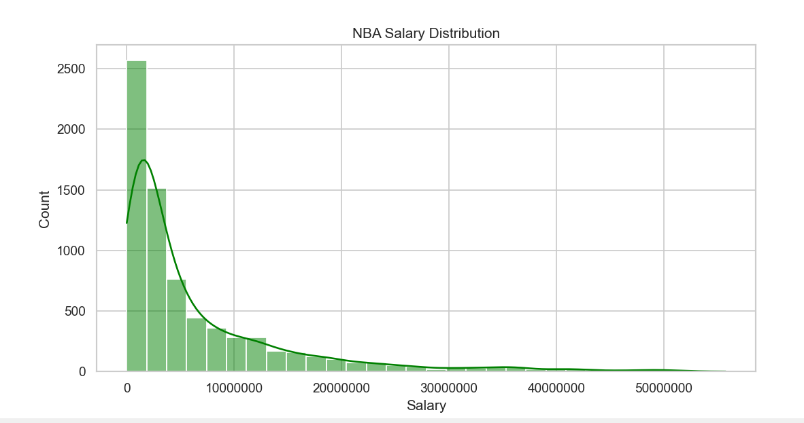
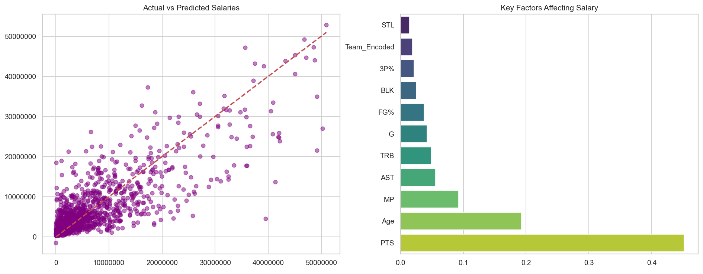

# 🏀 NBA Salary Prediction (Machine Learning)

This project is a key milestone in my Data Science journey. As a Computer Engineering student at ADNSU with a background in System Administration, I wanted to bridge the gap between raw sports statistics and financial value using Machine Learning.

## 🧐 Why this project?
Basketball is a data-rich environment, making it perfect for regression analysis. My goal was to see how much a player's performance on the court (points, minutes, assists) actually dictates their market value in the modern NBA (2010-2025).

## 🛠️ Engineering Highlights

1. **Data Sanitization:** Raw Kaggle datasets often store salaries as strings (e.g., "$25,000,000"). I implemented a cleaning pipeline to convert these into numerical formats for mathematical processing.
2. **Dynamic Feature Mapping:** I wrote the feature selection logic to be robust. If the dataset column names change (e.g., 'GP' vs 'G'), the script automatically detects and utilizes the available performance metrics.
3. **Model Selection:** I chose the `GradientBoostingRegressor`. After tuning hyperparameters like learning rate and tree depth, I achieved a balance where the model recognizes both "Superstar" pikes and "Bench Player" minimums.

## 📊 Visual Analysis & Insights

The model currently operates with an **R2 Score of 0.66**. This suggests that while stats are a primary driver, about 34% of a salary is influenced by external factors like team salary caps, market size, or contract timing.

### 1. Salary Distribution
The NBA has a "long-tail" salary distribution. Most players earn closer to the league minimum, while a small percentage of elite players capture the top-tier contracts.

### 2. Predictions vs. Reality & Feature Importance
The left plot shows the correlation between my model's predictions and actual salaries. The right plot confirms that **Points (PTS)** and **Minutes Played (MP)** remain the most significant factors in determining a player's paycheck.

## 💻 Technical Setup
- **Stack:** Python (Pandas, Scikit-learn, Seaborn, Matplotlib)
- **Primary File:** `nba_salary_prediction.py`
- **Algorithm:** Gradient Boosting Regressor

---
**Developed by:** Ali Hasanov
Feel free to connect with me on [LinkedIn](https://www.linkedin.com/in/ali-hasanov-3611933b5?utm_source=share&utm_campaign=share_via&utm_content=profile&utm_medium=android_app)
